# Projekt z przedmiotu Eksploracja Danych
## Pierwszy etap: Zrozumienie problemu + Zrozumienie danych

**Dane:** Pokemon - Weedle's Cave  
**Autorzy:** Jakub Nowak 197860 , Oliwier Komorowski 197808, Piotr Staszko 197938

---

### Ogólny opis zbioru
Zbiór danych zawiera statystyki Pokemonów oraz historyczne wyniki ich walk. Każdy z rekordów w podstawowym pliku opisuje charakterystykę danego Pokemona (punkty zdrowia, punkty ataku, obrony, itd.). Dodatkowe pliki opisują rezultaty stoczonych potyczek między poszczególnymi Pokemonami. Należy uwzględnić dodatkowy wpływ mechaniki opisanej w źródle – pierwszy podany w walce Pokemon atakuje pierwszy.

### Określenie celu eksploracji i kryteriów sukcesu
Celem eksploracji jest predykcja wyników przyszłych walk Pokemonów na bazie ich charakterystyki oraz historii poprzednich starć.
Docelowo rozwiązywanym problemem będzie klasyfikacja binarna (przewidywanie, czy wygra pierwszy z walczących Pokemonów).
Dodatkowym celem jest określenie, które atrybuty mają największy wpływ na predykcję wygranej.

W przypadku danego problemu istotną metryką będzie trafność (ang. *accuracy*), która informuje o tym, jak dobrze model ogólnie klasyfikuje zwycięzcę. Chcielibyśmy, aby nasz model poprawnie wyznaczał zwycięzcę dla jak największej liczby walczących par. Trafność jest metryką o poniższym wzorze:

$$Accuracy = \frac{TP + TN}{TP + TN + FP + FN}$$

gdzie:
$TP$ (z ang. *true positive*) - liczba przypadków prawdziwie pozytywnych
$FN$ (z ang. *false negative*) - liczba przypadków fałszywie negatywnych
$TN$ (z ang. *true negative*) - liczba przypadków prawdziwie negatywnych
$FP$ (z ang. *false positive*) - liczba przypadków fałszywie pozytywnych

Ponieważ obie klasy (wygrana pierwszego Pokemona lub wygrana drugiego Pokemona) są naturalnie dystrybuowane, a błąd w dowolną stronę niesie ze sobą te same konsekwencje (w przeciwieństwie np. do diagnozy nowotworu medycznego), wykorzystanie trafności jest w tym przypadku miarą idealną i samowystarczalną.
Sukces zostanie osiągnięty, jeżeli model uzyska trafność na poziomie powyżej 85%.

### Charakterystyka zbioru danych
* **Pochodzenie:** Platforma Kaggle (dataset: *terminus7/pokemon-challenge*). Wynika z bazy gier "Pokemon", przy czym dane o samych walkach zostały wygenerowane algorytmicznie.
* **Format i struktura:** Zbiór jest dostarczony w postaci 3 plików CSV umieszczonych w folderze `dataset/`.
* **Rozmiar:** 
  * `pokemon.csv` – 800 przykładów (statystyki Pokemonów) i 12 atrybutów.
  * `combats.csv` – 50 000 przykładów (wyniki wcześniejszych walk) i 3 atrybuty.
  * `tests.csv` – 10 000 przykładów (zbiór, na którym model ma finalnie przewidzieć walki) i 2 atrybuty.

### Opis atrybutów

W ogólności w tym zbiorze danych informacje podzielone są na dwa główne bloki tematyczne, w związku z czym atrybuty odwołują się do dwóch różniących się kategorii:
- **Cechy własne (pokemon.csv)**: definiują odgórnie przypisane wartości bazowe oraz klasyfikację genetyczną poszczególnych organizmów.
- **Wyniki starć (combats.csv / tests.csv)**: definiują identyfikatory historycznych potyczek turniejowych oraz diagnozę ostatecznej wygranej.

Poniżej zamieszczono opis poszczególnych atrybutów zarówno numerycznych, jak i nominalnych. Atrybuty numeryczne w głównej mierze opisane zostały w odniesieniu do pojedynczego organizmu Pokemona (jego poszczególne statystyki przetrwania i ataku). Dokładne jednostki miary danych atrybutów liczbowych niestety nie zostały podane przez twórców zbioru danych - pochodzą one z empirycznej mechaniki cyfrowego środowiska gry wideo, więc nie odpowiadają rzeczywistym fizycznym jednostkom i należy je uznać za całkowicie względne wartości punktowe (tzw. *points*).

**Plik pokemon.csv**

| Nazwa        | Typ                  | Znaczenie                                                                                                                                                                                                                                                       |
| ------------ | -------------------- | --------------------------------------------------------------------------------------------------------------------------------------------------------------------------------------------------------------------------------------------------------------- |
| `#`          | Numeryczny           | Unikalny identyfikator reprezentujący danego Pokemona.                                                                                                                                                                                                          |
| `Name`       | Nominalny            | Atrybut przechowujący nazwę rozpoznawczą gatunku Pokemona.                                                                                                                                                                                                      |
| `Type 1`     | Nominalny            | Podstawowy typ/żywioł Pokemona (np. Grass, Fire). Wpływa on na mnożniki odporności i wrażliwości w walkach z innymi monstrami. W grze występuje 18 unikalnych klas tego atrybutu.                                                                               |
| `Type 2`     | Nominalny            | Dodatkowy typ/żywioł Pokemona krzyżujący odporności u rzadszych osobników. Atrybut ten może być pusty, co oznacza brak hybrydowości organizmu pierwszego typu.                                                                                                  |
| `HP`         | Numeryczny           | Atrybut informuje o puli punktów zdrowia w organizmie Pokemona. Determinuje on ilość obrażeń (tzw. hit points), które potwór może przyjąć przed utratą przytomności. Wyższe `HP` jest utożsamiane z wytrzymalszymi klasami.                                     |
| `Attack`     | Numeryczny           | Parametr kalkulujący ilość bazowych obrażeń fizycznych. Wyższa wartość determinuje generowanie potężniejszych standardowych ataków na statystyki powłoki uszkodzeń przeciwnika.                                                                                 |
| `Defense`    | Numeryczny           | Atrybut reprezentujący twardość powłoki obronnej. Odpowiada za bezpośrednią redukcję fizycznych ataków otrzymywanych od rywala. Wyższe parametry to wyższa obrona tkanki potwora.                                                                               |
| `Sp. Atk`    | Numeryczny           | Wartość generująca rzadsze, silniejsze ataki specjalne oraz ataki żywiołów (np. dystansowe ataki ogniem bądź trucizny umysłu), pomijające częściowo standardową fizyczną obronę przeciwnika.                                                                    |
| `Sp. Def`    | Numeryczny           | Statystyka oznaczająca odpowiedź na `Sp. Atk`. Powala zredukować lub uodpornić na wymianę i efekty ataków specjalnych czy ataków w słabość rzuconych przez wrogiego osobnika.                                                                                   |
| `Speed`      | Numeryczny           | Istotny atrybut informujący o priorytetach uderzeń. Determinuje, kto atakuje i podejmuje tury pierwszy w ramach symulacji gry. Atrybut z wysokimi współczynnikami stanowi kluczową przewagę bojową.                                                             |
| `Generation` | Numeryczny           | Parametr generacji wyznaczający rok występowania i edycję oprogramowania (gry) w jakiej zaimplementowany został Pokemon. Przyjmuje ramy dyskretne: zbiór liczbowy 1-6.                                                                                          |
| `Legendary`  | Nominalny / Logiczny | Flaga atrybutu informująca, czy stwór zalicza się do ekstremalnie rzadko rodzących się legendarnych gatunków. Gatunki 'True' charakteryzują się z reguły odgórnym wybitnym ulepszeniem pozostałych ról numerycznych i stanowią elitarną stawkę (statusu bossa). |

**Pliki combats.csv / tests.csv**

| Nazwa            | Typ        | Znaczenie                                                                                                                                     |
| ---------------- | ---------- | --------------------------------------------------------------------------------------------------------------------------------------------- |
| `First_pokemon`  | Numeryczny | Identifier pierwszego walczącego Pokemona, pobierający z bazy wariant uderzający zawsze jako pierwszy na wejściu.                             |
| `Second_pokemon` | Numeryczny | Identifier drugiego walczącego, defensywnego na wejściu Pokemona.                                                                             |
| `Winner`         | Numeryczny | Zmienna celu wskazująca po identyfikatorze ostatecznego wygranego starcia pomiędzy podaną w zbiorze parą. (Obecna tylko w pliku combats.csv). |

### Wyniki eksploracyjnej analizy danych (EDA)

1. **Rozkłady wartości atrybutów**

| Atrybut    | Histogram                                          |
| ---------- | -------------------------------------------------- |
| HP         | 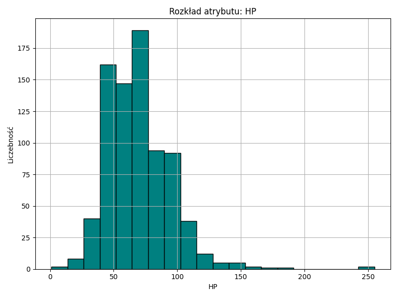                 |
| Attack     | 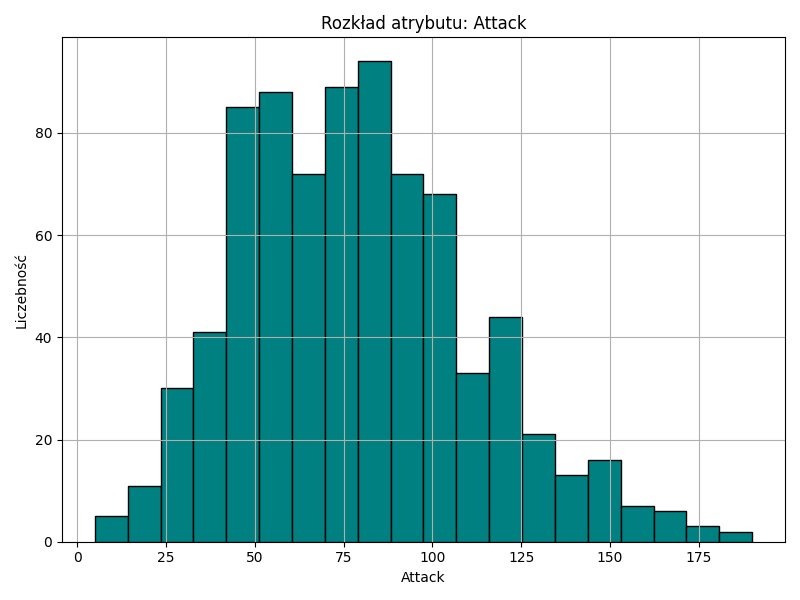         |
| Defense    | 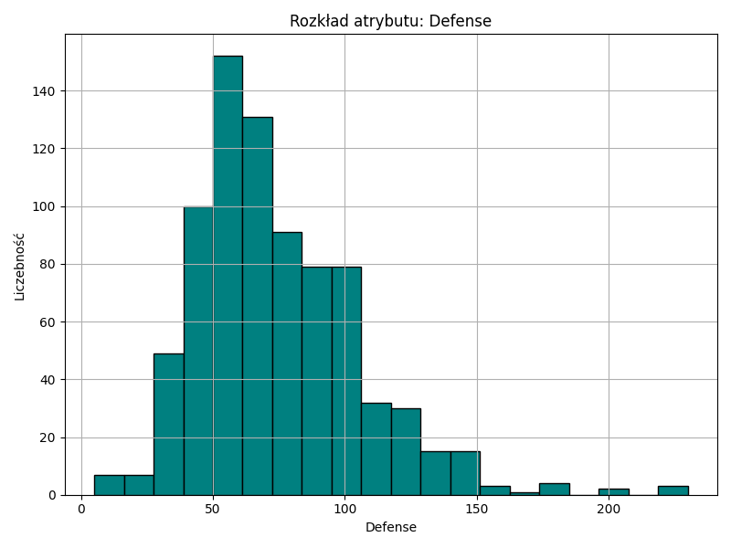       |
| Sp. Atk    | 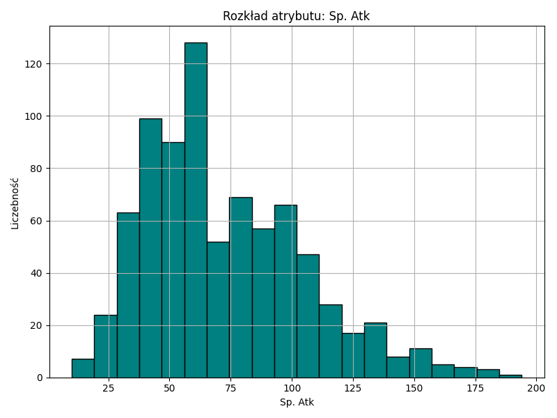        |
| Sp. Def    | 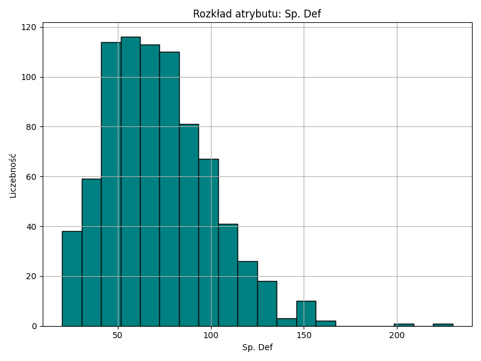        |
| Speed      | 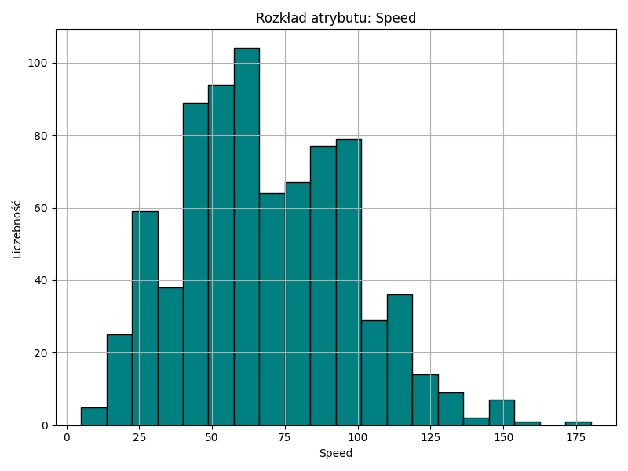           |
| Generation | 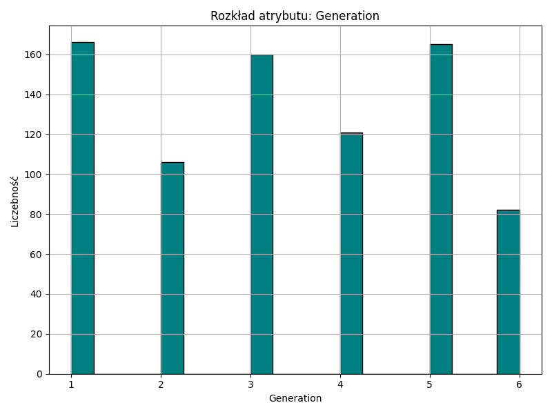 |
| Type 1     | 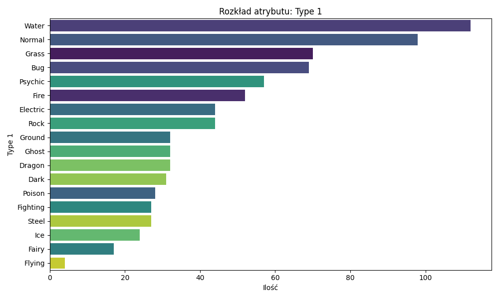         |
| Type 2     | 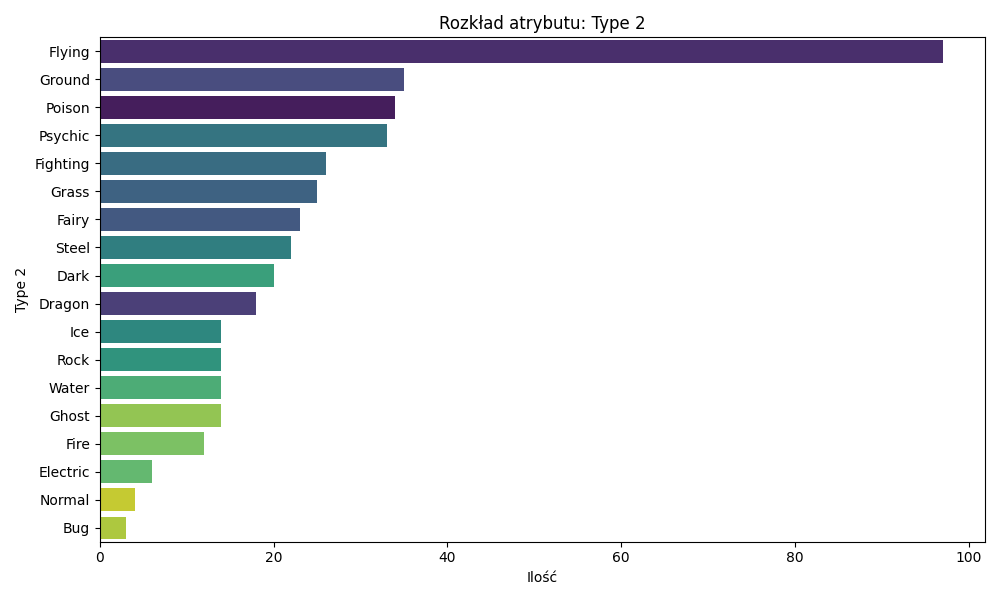         |
| Legendary  | 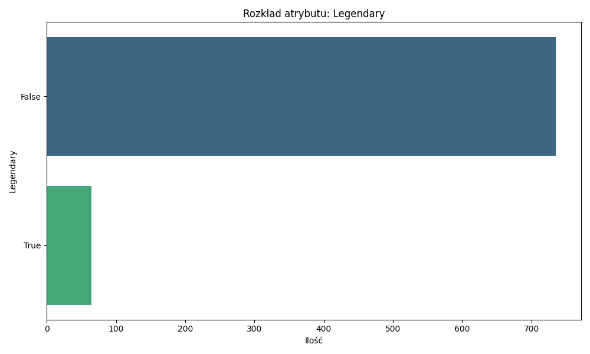   |
   
   **Wnioski:**
   - W przypadku zmiennej celu (zwycięstwo pierwszego lub drugiego Pokemona wynikające ze zbioru walk), klasy są bardzo dobrze zbalansowane ze względu na specyfikę konstrukcji turnieju. Równy rozkład ułatwi proces dalszych analiz i trenowania modelu klasyfikacji.
   - Rozkłady wszystkich analizowanych atrybutów numerycznych związanych ze statystykami (`HP`, `Attack`, `Defense`, `Sp. Atk`, `Sp. Def`, `Speed`) wydają się nie być w pełni normalne. Najczęściej mamy do czynienia z rozkładem prawoskośnym - rozkład jest przesunięty w lewo a dłuższy ogon znajduje się po prawej stronie wykresu.
   - Najsilniejsze Pokemony (szczególnie te z flagą `Legendary`) odznaczają się unikalnie wysokimi atrybutami, ponieważ pełnią rolę tzw. "bossów" w uniwersum. W związku z czym wysokie, nieliczne wartości (ogon rozkładu) wymienionych atrybutów bojowych mogą stanowić bardzo silny wskaźnik sugerujący Pokemona, który częściej będzie zwyciężał (status `Winner`).
   - W przypadku atrybutów kategorycznych, takich jak `Type 1`, możemy dostrzec silne skupisko w lewej stronie rozkładu – dominują głównie żywioły Water oraz Normal. Pozostałe klasy (np. Flying) występują sporadycznie początkowych wartościach. Różnorodność typów w ogonie rozkładu wpłynie na to, w jaki sposób model będzie brał pod uwagę macierze przewag żywiołów (np. Ogień wygrywa z Trawą).

   **Sprawdzenie testem statystycznym - dodatkowo**
   Określenie, czy rozkład atrybutu jest normalny czy nie po prostu na niego patrząc najczęściej spełnia swoje zadanie. Jednakże w razie wątpliwości i w celu bardziej rzetelnego określenia normalności rozkładu można zastosować test statystyczny Shapiro-Wilka. Hipotezą zerowa tego testu brzmi: dana próba pochodzi z populacji o rozkładzie normalnym. Po obliczeniu wartości p należy ją porównać z przyjmowanym progiem (najczęściej 0,05). Jeżeli wartość p jest większa od 0,05 oznacza to, że dane pasują do hipotezy zerowej - możemy uznać rozkład danego atrybutu za normalny. Natomiast, jeżeli wartość p jest mniejsza od 0,05 to należy odrzucić hipotezę zerową - uznajemy, że rozkład atrybutu nie jest normalny. Wartość p można rozumieć jako prawdopodobieństwo uzyskania takiego wyniku, przy założeniu, że hipoteza zerowa jest prawdziwa. Na przykład: jeśli p jest małe (np. mniejsze niż 0,05), to istnieje małe prawdopodobieństwo, że takie dane zostałyby zaobserwowane, jeśli rozkład byłby normalny – co może sugerować, że rozkład nie jest normalny.

| Atrybut    | Wartość p dla testu Shapiro-Wilka |
| ---------- | --------------------------------- |
| HP         | 1,15e-20                          |
| Attack     | 2,47e-09                          |
| Defense    | 9,92e-18                          |
| Sp. Atk    | 4,67e-14                          |
| Sp. Def    | 8,25e-14                          |
| Speed      | 1,31e-07                          |
| Generation | 8,71e-22                          |

**Wnioski**
Na podstawie powyższej tabeli możemy powiedzieć z dużą pewnością, że wszystkie atrybuty numeryczne nie mają rozkładu normalnego (wartość p jest znacznie mniejsza od progu 0,05). Dodatkowo widać, że atrybuty `Speed` oraz `Attack` mają jedne z najwyższych wartości p, lecz wciąż zdecydowanie mniejsze od 0,05.

2. **Korelacje pomiędzy wartościami atrybutów**

   W celu obliczenia korelacji z wynikiem walki zamieniono zwycięstwo pierwszego Pokemona (zmienna celu `First_won`) na 1 i przegraną na 0. W związku z faktem, że żaden atrybut nie miał rozkładu normalnego stosuję korelację Spearmana.

   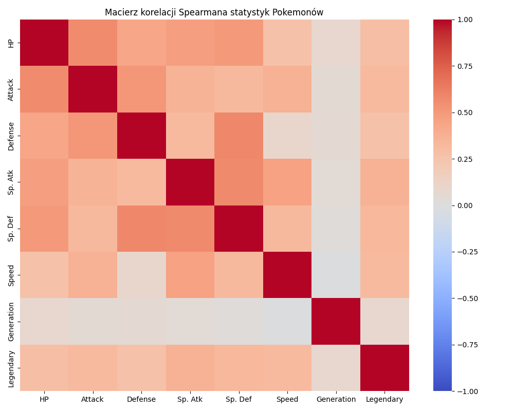
   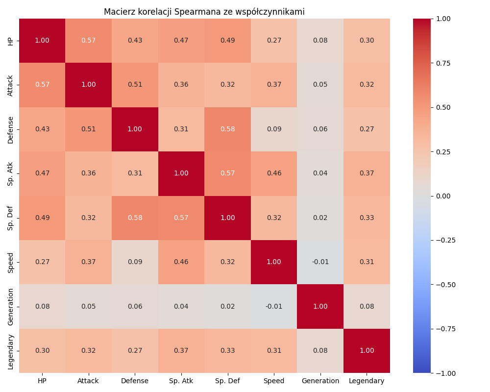
   
   **Wnioski:**
   - Widoczne są grupy atrybutów z silną korelacją między sobą w obrębie podstawowych statystyk bojowych: `Attack`, `Defense`, `Sp. Atk`, `Sp. Def` oraz `HP`. Wszystkie te atrybuty odnoszą się do ogólnej siły i zaawansowania ewolucyjnego Pokemona, zatem jest to bardzo sensowne, że te parametry rosną równomiernie i korelują potężnie wspólnie. Dodatkowo korelacja ta staje się wymiernie widoczna w odniesieniu do atrybutu `Legendary` – rzadkie i legendarne potwory charakteryzują się odgórnie ekstremalnie wysokimi, podbitymi wartościami wszystkich tych bazowych statystyk w uniwersum. Mniejszą korelację możemy zaobserwować np. z atrybutem pokolenia (`Generation`), co oznacza, że wraz z wychodzeniem nowszych edycji parametry bojowe pozostają relatywnie wyrównane i nie są znacząco podbijane pod zjawisko "power creepingu". Sama korelacja dodatnia pomiędzy atrybutami uderzeń dystansowych (`Sp. Atk`, `Sp. Def`) a standardowymi fizycznymi uderzeniami (`Attack`, `Defense`) może wynikać z pojawiania się na nowszych etapach gry coraz większej ilości wyewoluowanych form, co po prostu podnosi wszystkie te wartości naraz.

   **Korelacja z atrybutem wygranej (diagnozą sukcesu)**
   
   W celu wyznaczenia konkretnych atrybutów determinujących zwycięstwo na potrzeby modelu predykcyjnego zestawiono różnice w parametrach obu przeciwników (`Diff_...`) i obliczono ich relację ze zmienną `First_won` (1 dla zwycięstwa, 0 dla porażki w walce).

   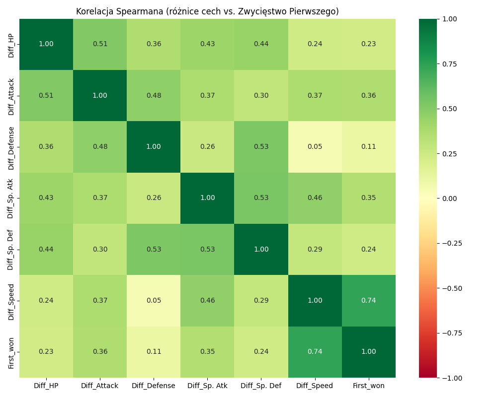
   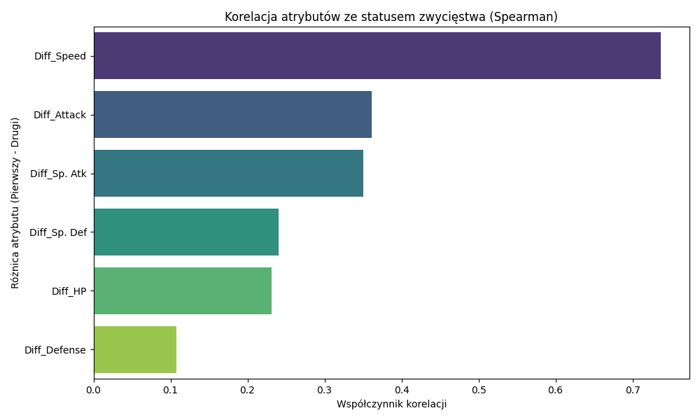
   
   **Wnioski:**
   - W przypadku atrybutu oznaczającego wygraną widać, że wszystkie analizowane, różnicowe atrybuty numeryczne wykazują dość równą, dodatnią korelację. W żaden sposób nie wpływają przeciwnie (nie zmniejszają szansy). 
   - Atrybut różnicy w szybkości (`Diff_Speed`) odstaje jako gigantyczna ekstremalna anomalia w pozytywnym sensie – współczynnik na poziomie wyższym niż 0.7. Klasy o wyższym modyfikatorze szybkości najczęściej dokonują w grze natychmiastowego uderzenia kończącego, w związku z czym `Speed` to najbardziej krytyczny i sensowny atrybut wskazujący "diagnozę sukcesu" turniejowego.
   - Atrybuty wybitnie ofensywne (`Diff_Attack`, `Diff_Sp. Atk`) stanowią kolejną odizolowaną grupę atrybutów, silnie korelującą z finalnym wynikiem na poziomie oscylującym przy 0.5. Wynika to nierozerwalnie ze schematu zadawania odpowiednio krytycznych ciosów już przy pierwszej turze zaraz po `Speed`. Zatem jest to bardzo sensowne, że silnie przełożą się na losy modelu.
   - Elementy związane typowo ze statystykami wytrzymałości oraz zdrowia komórek organizmu Pokemonów – czyli `Diff_HP` (0.34), `Diff_Defense` czy `Diff_Sp. Def` wykazują mniejszą, najniższą korelację z klasą wygranej. Sama słabsza korelacja pozwala zaobserwować, że w budowanym przez nas odniesieniu to agresorzy dyktują reguły walk, a potwory "pod obronę" (obfite w HP czy szczelność powłoki) są po prostu regularnie ignorowane logiką turniejową i ich wybór do walk nie rokuje zwycięstwa w takim stopniu jak ofensywa.
   
3. **Wstępne ustalenia dotyczące zawartości zbioru**
   * Posiadanie dwóch różniących się typów plików zmusza nas do wykonania połączeń tabel (*join/merge*) za pomocą identyfikatorów Pokemona. Tylko zestawienie statystyk z wynikiem walki pozwoli na budowę odpowiedniego modelu.

### Uwagi na temat jakości danych
* **Dane brakujące:** Zidentyfikowano **1 brak nazwę dla Pokemona** (`Name` ma 1 Null) oraz **386 brakujących wartości** dla `Type 2`. Braki w `Type 2` wynikają ze specyfiki świata Pokemon (nie wszystkie posiadają typ drugorzędny), przez co zamiast je usuwać, warto uzupełnić je etykietą `None` (lub `Brak`). W `combats.csv` nie odnotowano braków.
* **Dane niespójne:** Ze względu na to, że dane w bazowym pliku *pokemon.csv* określają cyfrowe wartości generowane przez twórców gier wideo, niespójność można weryfikować głównie za pomocą powiązań między założeniami mechaniki. Jednakże ze względu na wysokie korelacje pomiędzy atrybutami dotyczącymi siły potworów (np. wzajemnie zależny wzrost `Attack`, `Defense`, `Sp. Atk`, `Sp. Def` wraz z flagą rzadkości `Legendary`), możemy założyć, że dane są spójne. Dana wysoka korelacja nie wyklucza 100% ukrytych błędów merytorycznych, jednakże powiązania tych wskaźników siły wydają się w oczywisty sposób logiczne.
* **Dane niezrozumiałe:** W ogólności dane są zrozumiałe na dość intuicyjnym poziomie. Dla niektórych czytelników rodzą się pytania o ramy przeliczania logiki obciążeń w grze - na przykład brak dokładnych wzorów "custom algorytmu turniejowego" odpowiadającego z udostępnione wyniki w pliku *combats*. Nie wiemy chociażby, z jakim algorytmicznym współczynnikiem wzmacniającym kalkulowane są uderzenia w słabość przeciwnika uwzględniając skrzyżowanie `Type 1` i `Type 2`. Jednakże na potrzeby tego projektu takie intuicyjne zrozumienie podstaw atrybutów wydaje się być wystarczające i model powinien dać radę samodzielnie dojść do interesujących i dobrych wniosków predykcyjnych.
* **Punkty oddalone:** Analizując punkty oddalone można dojść do wniosku, że dane są bardzo dobrej jakości. Średnia liczba punktów oddalonych względem atrybutów numerycznych wynosi ok. 10 (metodą rozstępu ćwiartkowego IQR), co stanowi zaledwie ok. 1,2% wszystkich dostępnych 800 danych wejściowych w zbiorze Pokemon. Atrybutami o największej liczbie punktów oddalonych są atrybuty `HP` (19 punktów oddalonych: ok. 2,4% danych zbioru jednostek), `Defense` (13 punktów oddalonych: ok. 1,6%) oraz `Sp. Atk` (10 punktów: ok. 1,2%). Odbiegające wartości stanowią charakterystykę wyjątkowych bosów (Legendary), w związku z czym absolutnie nie stanowią błędu, a jedynie wzmacniają siłę przewidywań przyszłego klasyfikatora.

| Atrybut | Wykres pudełkowy                 | Wartości                                                                                                                             |
| ------- | -------------------------------- | ------------------------------------------------------------------------------------------------------------------------------------ |
| HP      | 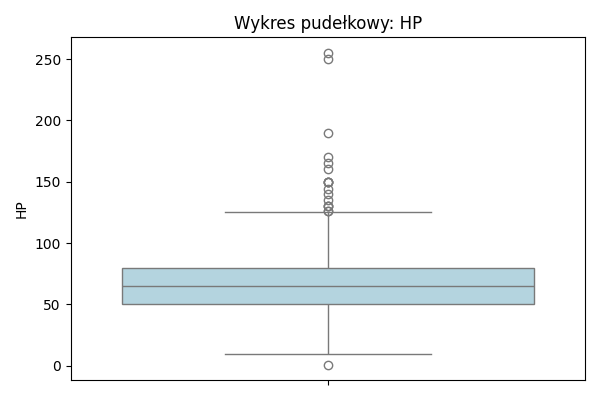      | Mediana: 65.00  Przedział wartości występujących najczęściej: [10.00; 125.00]  Liczba punktów oddalonych: 19 |
| Attack  | 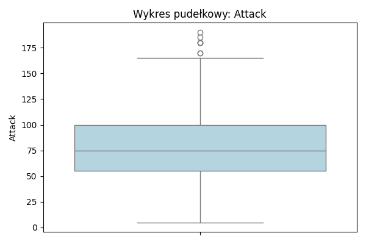  | Mediana: 75.00  Przedział wartości występujących najczęściej: [5.00; 165.00]  Liczba punktów oddalonych: 7   |
| Defense | 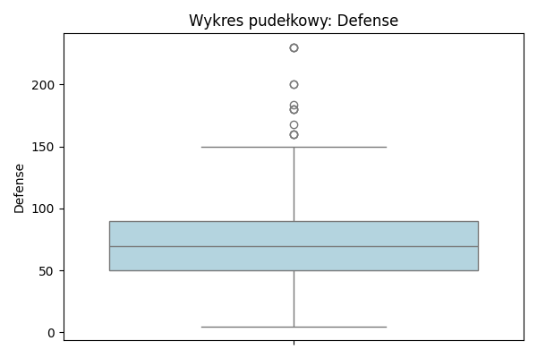 | Mediana: 70.00  Przedział wartości występujących najczęściej: [5.00; 150.00]  Liczba punktów oddalonych: 13  |
| Sp. Atk | 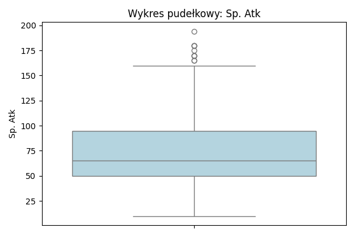  | Mediana: 65.00  Przedział wartości występujących najczęściej: [10.00; 160.00]  Liczba punktów oddalonych: 10 |
| Sp. Def | 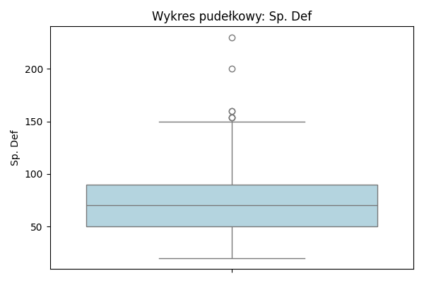  | Mediana: 70.00  Przedział wartości występujących najczęściej: [20.00; 150.00]  Liczba punktów oddalonych: 7  |
| Speed   | 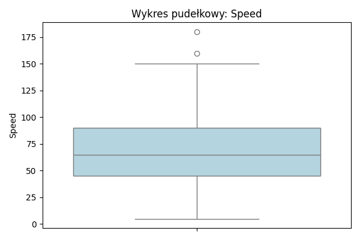   | Mediana: 65.00  Przedział wartości występujących najczęściej: [5.00; 150.00]  Liczba punktów oddalonych: 2   |

### Podsumowanie
Na początku przeprowadzono analizę rozkładów, z której wynika, że atrybuty numeryczne nie mają rozkładów normalnych, a klasy rozkładu w turniejach cechują się zmiennością. W związku z tym, że rozkłady nie były normalne zastosowano metodę Spearmana do analizy korelacji. Z analizy korelacji wynika, że występują grupy atrybutów silnie ze sobą skorelowane – pierwsza grupa: `Attack`, `Defense`, `Sp. Atk`, `Sp. Def`, druga grupa obejmuje powiązanie `HP` z bazowymi statystykami. Ze względu na dużą korelację danych atrybutów, przekazują one podobną informację (definiując ogólną potęgę Pokemona związaną m.in. z ewolucją czy przynależnością do klasy `Legendary`), co może być redundantne dla modelu.

Następnie obliczono korelację względem atrybutu celu – diagnozy walki (`First_won`). Atrybutami, które silnie korelują ze zmienną wygranej są w kolejności zróżnicowanej siły: `Diff_Speed`, `Diff_Attack`, `Diff_Sp. Atk`, `Diff_Sp. Def`, `Diff_HP` i `Diff_Defense`. Są to przeważnie atrybuty należące do grup silnie skorelowanych zmiennych bojowych. W związku z czym w fazie modelowania można rozważyć usunięcie niektórych atrybutów pozostawiając tylko kluczowy w grupie, przykładowo biorąc pod uwagę fenomenalne wartości korelacji ze zmienną zwycięstwa – priorytetowy i wystarczający może okazać się `Diff_Speed` w asyście `Diff_Attack`.

Dodatkowo większość atrybutów (zwłaszcza różnicowych) ma korelację dodatnią z wynikiem bitwy, z czego wynika, że ich wyższe wartości częściej występują wśród przypadków ostatecznego zwycięstwa (ponieważ do obliczania korelacji wygrana reprezentowana przez pierwszego osobnika została zamieniona na 1, a dla drugiego na 0). Zgadza się to z biomechaniką gier oraz właściwościami struktury obrażeń w grze, w której przewaga szybkości i siły generuje potężną inicjatywę tur oraz gwarantuje zadanie miażdżących uderzeń krytycznych przed odpowiedzią wolniejszego, słabszego okazu.

Następnie dokonano oceny jakości danych. Głównym mankamentem danych jest nieprecyzyjne wyjaśnienie kolumn w algorytmie wynikowym walk - nie podano wzorów ich dokładnego wyznaczania (silnika turniejowego) oraz ewentualnych wskaźników losowości czy mnożników żywiołów. Dlatego wyjściowo ciężko jest ze stuprocentową pewnością ocenić, czy występowanie każdego punktu w pełni ma sens, czy też nie (bez znania całego kodu turnieju). Jednakże ze względu na silną dodatnią korelację dodatnich wartości ze statusem zwycięzcy, występowanie outlierów w głównych statystykach zawsze świadczy o przytłaczającej wyższości elitarnej potęgi danego osobnika, a zatem jest wysoce przydatne dla modelu. W związku z czym najlepszą decyzją docelową byłoby ścisłe pozostawienie wartości odstających w zbiorze bez ingerencji.

Biorąc pod uwagę stosunkowo dobrą jakość danych, cel eksploracji jest możliwy do spełnienia.
